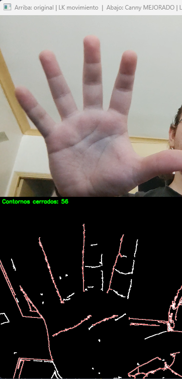
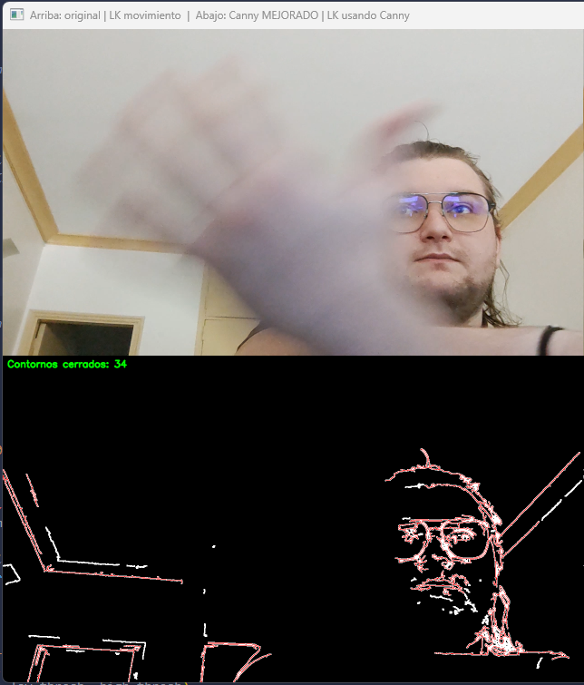

# TP-Final-Canny-LK

# Trabajo final de la materia Procesamiento de Imágenes - ITBA
## Integrantes:
- Hertter, José Iván - 62499
- Oms, Mariano Alejandro - 62080

## Descripción
Implementación de un sistema de seguimiento de objetos en video utilizando los algoritmos de detección de bordes de Canny y el método de Lucas-Kanade para el seguimiento de puntos característicos.
La idea principal es detectar features en el primer frame para hacer el trackeo LK y despreciar todos aquellos features que no estén cerca de los bordes detectados por Canny que no sean considerados estáticos.

## Flujo del programa
### Bibliotecas utilizadas
- OpenCV
- NumPy
### Pasos principales
-  Selección de Input de video o cámara. Optamos por la selección de la cámara por defecto (0).
- Captura de frame y conversión a escala de grises.
- Obtención del brillo del frame estimando con el valor medio de los pixeles.
- Ajuste de los parámetros de Canny y Shi-Tomasi en función del brillo.
- Detección de bordes utilizando el algoritmo de Canny.
    - Obtención de la diferencia entre frames consecutivos para subsanar efectos de motion blur.
    - Dilatación de la imagen de bordes para mejorar la detección.
    - En el bloque de código siguiente se muestra cómo se calcula la máscara de movimiento:
        ``` 
        diff = abs(frame_gray - prev_gray) 
        _, motion_mask = cv2.threshold(diff, MOTION_THRESH, 255, ...)
        ```
        Acá, el resultado son píxeles blancos solo donde hubo cambios muy fuertes.
- Obtención de features utilizando el método de Shi-Tomasi.
- Filtrado de features cercanos a los bordes detectados.
- Seguimiento de los features utilizando el método de Lucas-Kanade.
- Visualización de los resultados en tiempo real.

### ¿Qué observamos en el desarrollo?

Relacionado al algoritmo de `Canny`:
- La importancia de ajustar los parámetros de detección en función del brillo y el contraste del frame para mejorar la detección de bordes.

    

- La necesidad de considerar la diferencia entre frames consecutivos para evitar efectos de motion blur.

    

- La utilidad de la dilatación para mejorar la detección de bordes en presencia de ruido.

## Filtrado de bordes estáticos mediante análisis temporal

Durante las primeras pruebas observamos que el algoritmo de Canny detectaba gran cantidad de bordes pertenecientes al fondo (marcos, paredes, muebles, monitor, etc.).  
Estos bordes no aportan información relevante al seguimiento y generan *features* espurias que afectan negativamente la estabilidad del método de Lucas-Kanade.

Para resolver esto implementamos un **modelo temporal de contornos estáticos**, basado en:

- posición del contorno (centro del bounding box),
- tamaño aproximado (w, h),
- cantidad de apariciones acumuladas (`life`),
- última aparición (`last_seen`),
- tolerancia espacial y de tamaño (`STATIC_MATCH_DIST`, `STATIC_SIZE_TOL`).

La idea es sencilla:  
si un contorno aparece reiteradamente en la misma región del frame, se clasifica como **estático** y se descarta en las siguientes etapas del pipeline.

Este filtro se inspira en conceptos vistos en la materia sobre **persistencia temporal de gradientes espaciales**: si un borde pertenece a un objeto completamente inmóvil, su gradiente espacial se repite; mientras que los bordes de objetos móviles presentan variabilidad entre frames.

El resultado final es una máscara de contornos **dinámicos**, que excluye sistemáticamente el fondo y solo conserva estructura relevante del objeto a seguir.

---

## Manejo del motion blur mediante gradientes espacio–temporales

Cuando un objeto se mueve rápido, el desenfoque de movimiento reduce drásticamente los gradientes espaciales en las aristas perpendiculares a la dirección del movimiento.  
Esto hace que Canny pierda bordes importantes justamente en las zonas donde el seguimiento es más crítico.

Aunque la materia presenta técnicas de restauración (filtros inversos, Wiener, Richardson–Lucy), estas dependen de conocer o estimar la PSF asociada al blur de movimiento, y no son adecuadas para aplicar **en tiempo real** con una PSF distinta en cada frame.

En lugar de intentar reconstruir la imagen, adoptamos un método basado en **gradientes temporales**, consistente con la teoría del flujo óptico (uso conjunto de \(I_x, I_y, I_t\)).

### Etapas principales

1. **Detección de cambio temporal**
   ```python
   diff = cv2.absdiff(frame_gray, prev_gray)
   _, motion_mask = cv2.threshold(diff, MOTION_THRESH, 255, ...)
   motion_mask = cv2.dilate(motion_mask, None, iterations=DILATE_ITER)
   ```
    - ``diff`` resalta variaciones entre frames (derivada temporal $I_t$).

    - La dilatación convierte esas líneas finas en regiones completas de movimiento, necesarias para la integración posterior.

2. Generación de “bordes temporales”
    ```python
    blur_diff = cv2.GaussianBlur(diff, (3,3), 0)
    _, edges_diff = cv2.threshold(blur_diff, 25, 255, cv2.THRESH_BINARY)
    edges_diff = cv2.bitwise_and(edges_diff, motion_mask)
    ```
    Estos bordes provienen del cambio temporal, no del gradiente espacial.

3. Unión de bordes espaciales + temporales
    ```
    edges_space = canny_mejorado(...)
    edges = cv2.bitwise_or(edges_space, edges_diff)
    ```
    - ``edges_space``: bordes detectados por Canny clásico.

    - ``edges_diff``: bordes recuperados por variación temporal.

    - La unión permite obtener una estructura más completa, sin necesidad de restauración explícita de la imagen usando filtros inversos de los que no conocemos la PSF.
    
    Esta estrategia actúa como una compensación práctica del motion blur, sin introducir el costo computacional de algoritmos de deconvolución.

## Selección y filtrado de features para Lucas-Kanade

Para la detección de puntos de interés utilizamos Shi–Tomasi, pero aplicando dos restricciones clave:

1. Solo se detectan points-of-interest dentro de regiones que contienen bordes dinámicos, según:
    - Canny adaptativo,
    - bordes temporales,
    - filtrado de contornos estáticos.

2. Filtrado de outliers en Lucas-Kanade
    - Se eliminan puntos cuyo desplazamiento supera un umbral razonable (MAX_DISPLACEMENT).
    - Esto permite descartar errores del LK producidos por ruido, reflejos o tracking fallido.

Como resultado, los puntos que sobreviven son significativos y pertenecen únicamente a estructura móvil (por ejemplo, el rostro), logrando un seguimiento más limpio.

## Visualización del sistema
El programa presenta cuatro vistas simultáneas:
- Frame original
- LK basado en movimiento global (usando motion_mask)
- Bordes dinámicos filtrados (Canny + bordes temporales + contornos dinámicos)
- LK basado exclusivamente en bordes

Esto permite observar en tiempo real el comportamiento de cada bloque del pipeline y su aporte al resultado final.
